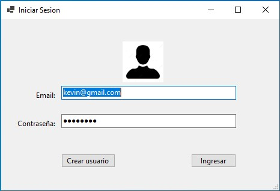
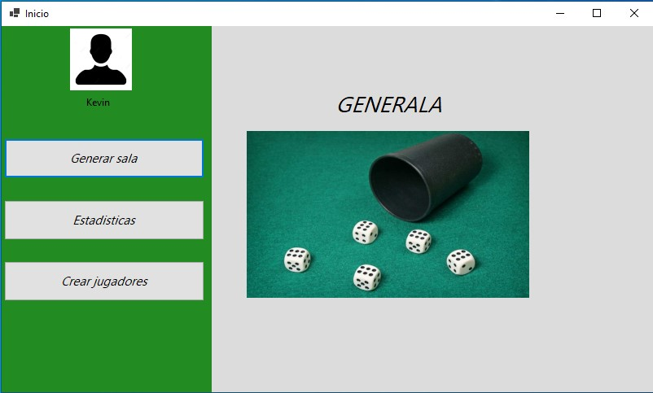
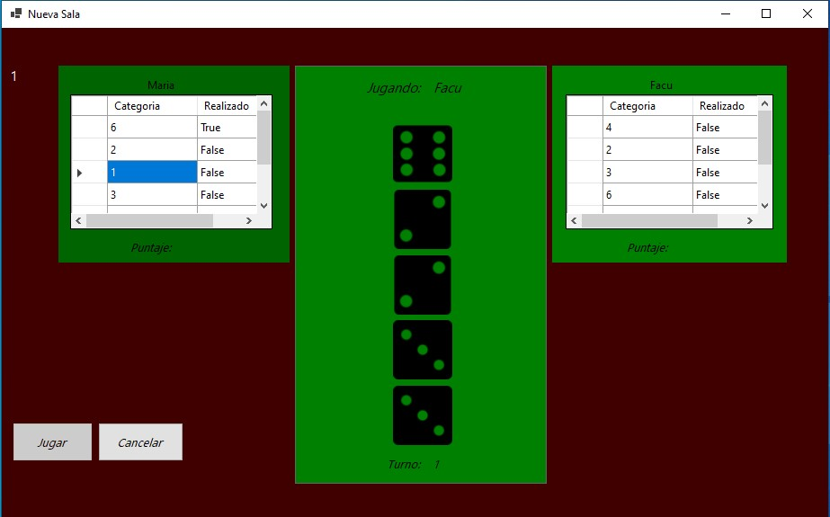
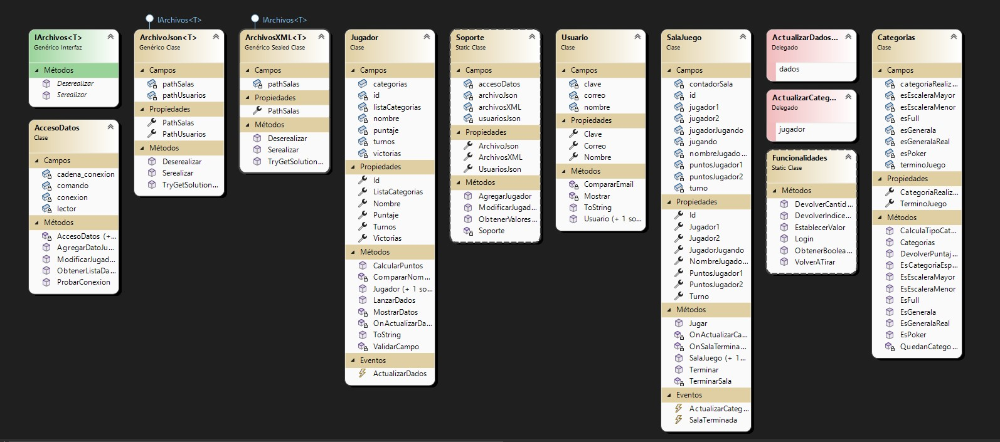

# Generala simulación.

## **Sobre mí**
### Mi nombre es Kevin Veliz y este trabajo fue un desafío con pro y contras a lo largo de su implementanción. No se me fue fácil, pero aprendí demasiado.

---

## **Resumen**
### La aplicación es una implementación del juego la generala. Comienza la app con una login en donde se puede iniciar sesión en caso de tener una cuenta creada o caso contrario la opción de poder generar una. Una vez dentro tendrá las opciones para generar salas, crear jugadores y ver las estadisticas obtenidas.







---


## **Diagrama de clase**


---


## **Justificación técnica**

### **Delegados.**

Utilice delegados para poder generar eventos.

```` C#
public delegate void ActualizarDadosEventHandler(List<int> dados);

public  delegate void ActualizarCategoriasEventHandler(Jugador jugador);
````

Su implementación se debe a que encapsulan la firma de los métodos que puede ser invocados por el evento, permiten la flexibilidad y la suscripción y desuscripción de múltiples métodos.

```` C#
public event ActualizarDadosEventHandler ActualizarDados;
````


### **Eventos.**
Utilice eventos para notificar el ganador, cambiar las imagenes de los dados correspondientes y para modificar los label una vez finalizada el juego.

```` C#
public event ActualizarDadosEventHandler ActualizarDados;

private void OnActualizarDados(List<int> dados)
{
    this.ActualizarDados?.Invoke(dados);
}

 this.sala.Jugador1.ActualizarDados += ActualizarDadosEventHandler;
                this.sala.Jugador2.ActualizarDados += ActualizarDadosEventHandler;

private void ActualizarDadosEventHandler(List<int> dados)
{
    this.picDado01.Image = this.DevolverImagen(dados[0]);

    this.picDado02.Image = this.DevolverImagen(dados[1]);

    this.picDado03.Image = this.DevolverImagen(dados[2]);

    this.picDado04.Image = this.DevolverImagen(dados[3]);

    this.picDado05.Image = this.DevolverImagen(dados[4]);
}               
````
---

### **Interfaces y generics**

Utilice una **interfaz** llamada IArchivos que es genérica que la cual la utilizo para dos clases génericas de archivos **JSON** y **XML** que van a implementar los métodos de la interfaz los cuales también son genericas para poder serealizar y deserealizar una lista de cualquier tipo de objeto.

```` C#
public interface IArchivos <T> where T : class
{
    public bool Serealizar(List<T> lista);
    public List<T> Deserealizar();
}
````

su implementanción. Cada clase debe implementar los metodos que contiene la interfaz, es decir, deben cumplir la firma.

```` C#
public sealed class ArchivoJson<T> : IArchivos<T> where T : class
{
    /// <summary>
    /// El método deserealiza una lista del tipo de dato la cual se haya inicializado la clase.
    /// </summary>
    /// <param name="path"></param>
    /// <returns>Retorna la lista obtenida.</returns>
    public List<T> Deserealizar(string path)
    {
        List<T> listXML = new List<T>();
        try
        {
            using (XmlTextReader sr = new XmlTextReader(path))
            {
                XmlSerializer serializer = new XmlSerializer((typeof(List<T>)));
                listXML = serializer.Deserialize(sr) as List<T> ?? new();
            }
        }
        catch (Exception ex)
        {
            Console.WriteLine($"ERROR: {ex.Message} - {ex.StackTrace}");
        }
        return listXML;
    }

    /// <summary>
    /// El método serealiza una lista del tipo de dato la cual se haya inicializado la clase.
    /// </summary>
    /// <param name="lista"></param>
    /// <param name="path"></param>
    /// <returns>Retorna un true en caso de exito o false en caso de fracaso.</returns>
    public bool Serealizar(List<T> lista, string path)
    {
        bool retorno = false;
        try
        {
            using (XmlTextWriter writer = new XmlTextWriter(path, Encoding.UTF8))
            {
                XmlSerializer ser = new XmlSerializer((typeof(List<T>)));
                ser.Serialize(writer, lista);
                retorno = true;
            }
        }
        catch (Exception ex)
        {
            Console.WriteLine($"ERROR:{ex.Message} - {ex.StackTrace}");
        }

        return retorno;
    }
}
public sealed class ArchivosXML<T> : IArchivos<T> where T : class
{
    private string pathSalas = Path.Combine(TryGetSolutionDirectoryInfo().Parent.FullName, @"salas.json");
    private string pathUsuarios = Path.Combine(TryGetSolutionDirectoryInfo().Parent.FullName, @"Usuarios.json");

    public string PathSalas { get =>        pathSalas; }
    public string PathUsuarios { get => pathUsuarios; }

    public static DirectoryInfo? TryGetSolutionDirectoryInfo(string currentPath = null)
    {
        DirectoryInfo? directory = new DirectoryInfo(currentPath ?? Directory.GetCurrentDirectory());
        while (directory != null && !directory.GetFiles("Program.cs").Any())
        {
            directory = directory.Parent;
        }
        return directory;
    }

    /// <summary>
    /// El método deserealiza una lista del tipo de dato la cual se haya inicializado la clase.
    /// </summary>
    /// <param name="path"></param>
    /// <returns>Retorna un true en caso de exito o false en caso de fracaso.</
    public List<T> Deserealizar(string path)
    {
        List<T> listaSalas = new List<T>();
        
        try
        {
            using (TextReader sr = new StreamReader(path))
            {
                listaSalas = JsonSerializer.Deserialize<List<T>>(sr.ReadToEnd()) ?? new();
            }
        }
        catch (Exception ex)
        {
            Console.WriteLine($"ERROR: {ex.Message} - {ex.StackTrace}");
        }
        
        return listaSalas;
    }

    /// <summary>
    /// El método serealiza una lista del tipo de dato la cual se haya inicializado la clase a un archivo JSON.
    /// </summary>
    /// <param name="lista"></param>
    /// <param name="path"></param>
    /// <returns>Retorna un true en caso de exito o false en caso de fracaso.</returns>
    public bool Serealizar(List<T> lista, string path)
    {
        bool retorno = false;
        try
        {
            using (TextWriter writer = new StreamWriter(path))
            {
                writer.Write(JsonSerializer.Serialize(lista));
                retorno = true;
            }
        }
        catch (Exception ex)
        {
            Console.WriteLine($"ERROR:{ex.Message} - {ex.StackTrace}");
        }
        return retorno;
    }
}
````
---

### **Base de datos.** ###
Implemento base de datos para el guardado, modificación y obtención de datos de los jugadores generados en el juego.
Tirando las consultas de **INSERT**, **UPDATE** y **SELECT**.

````C#

/// <summary>
/// El método conecta con la base de datos y genera la consulta para SELECT para obtener los datos de cada jugador y almacenarlo en una lista y cerrando la conexión.
/// </summary>
/// <returns>Retorna la lista extraída de la base de datos.</returns>
public List<Jugador> ObtenerListaDatoJugadores()
{
    List<Jugador> lista = new List<Jugador>();
    try
    {
        this.comando = new SqlCommand();
        this.comando.CommandType = CommandType.Text;
        this.comando.CommandText = "SELECT * FROM Jugadores_generala";
        this.comando.Connection = this.conexion;
        this.conexion.Open();
        this.lector = comando.ExecuteReader();

        while (lector.Read())
        {
            Jugador jugador = new Jugador();
            jugador.Id = (int)lector["ID"];
            jugador.Nombre = lector["Nombre"].ToString();
            jugador.Puntaje = (int)lector["Puntos"];
            jugador.Victorias = (int)lector["Victorias"];
            lista.Add(jugador);
        }
        lector.Close();
    }
    catch (Exception ex)
    {
        Console.WriteLine(ex.ToString());
    }
    finally
    {
        if (this.conexion.State == ConnectionState.Open)
        {
            this.conexion.Close();
        }
    }
    return lista;
}
/// <summary>
/// El método conecta con la base de datos y genera la consulta INSERT INTO para agregar un jugador a la tabla generada en la base de datos.
/// </summary>
/// <param name="jugador"></param>
/// <returns>Retorna true en caso de exito o false caso contrario.</returns>

public bool AgregarDatoJugador(Jugador jugador)
{
    bool rta = true;
    try
    {
        string sql = "INSERT INTO Jugadores_generala (Nombre, Puntos, Victorias) VALUES(";
        sql = sql + "'" + jugador.Nombre.ToString() + "'," + jugador.Puntaje + "," + jugador.Victorias + ")";

        this.comando = new SqlCommand();
        this.comando.CommandType = CommandType.Text;
        this.comando.CommandText = sql;
        this.comando.Connection = this.conexion;
        this.conexion.Open();
        int filasAfectadas = this.comando.ExecuteNonQuery();

        if (filasAfectadas == 0)
        {
            rta = false;
        }

    }
    catch (Exception ex)
    {
        Console.WriteLine(ex.ToString());
        rta = false;
    }
    finally
    {
        if (this.conexion.State == ConnectionState.Open)
        {
            this.conexion.Close();
        }
    }
    return rta;
}

/// <summary>
/// El método conecta con la base de datos y genera la consulta UPDATE para modificar un jugador de la tabla de la base de datos por medio.
/// </summary>
/// <param name="jugador"></param>
/// <returns>Retorna true en caso de exito o false caso contrario.</returns>
public bool ModificarJugador(Jugador jugador)
{
    bool rta = true;
    try
    {
        this.comando = new SqlCommand();
        this.comando.Parameters.AddWithValue("@ID", jugador.Id);
        this.comando.Parameters.AddWithValue("@Nombre", jugador.Nombre);
        this.comando.Parameters.AddWithValue("@Puntos", jugador.Puntaje);
        this.comando.Parameters.AddWithValue("@Victorias", jugador.Victorias);

        string sql = "UPDATE Jugadores_generala ";
        sql += "SET Nombre = @Nombre, Puntos = @Puntos, Victorias = @Victorias WHERE ID = @ID";

        this.comando.CommandType = CommandType.Text;
        this.comando.CommandText = sql;
        this.comando.Connection = this.conexion;

        this.conexion.Open();

        int filasAfectadas = this.comando.ExecuteNonQuery();

        if (filasAfectadas == 0)
        {
            rta = false;
        }
    }
    catch (Exception ex)
    {
        Console.WriteLine(ex.ToString());
        rta = false;
    }
    finally
    {
        if (this.conexion.State == ConnectionState.Open)
        {
            this.conexion.Close();
        }
    }
    return rta;
}
````

---

### **Archivos.** ###
Utilizo archivos para serealiza o deseralizar en JSON o XML.
Su implementación se encuentra en la explicación de interfaces y generics.

---

### **Hilos.** ###

Utilizo hilos para poder generar las salas en cada formulario, cada una de estás son independientes entre sí. Con la posibilidad de cancelar el hilo con un botón.


```` C#
private Task hiloSala;
hiloSala = Task.Run(() => sala.Jugar(this.cancellationTokenSource), token);

private async void FrmPrincipal_FormClosing(object sender, FormClosingEventArgs e)
{
    
    if (hiloSala != null && !hiloSala.IsCompleted)
    {
        cancellationTokenSource?.Cancel();
        e.Cancel = true;
        await hiloSala;
        this.Close();
    }
}
````

---

### **Excepciones.**
Utilizo excepciones genericas lanzando yo las excepciones y atrapandolas en donde corresponda, generando un mensaje en un label en caso de que se lance y capture la exception.

````C#
public Jugador(string nombre) :this()
{
    if (this.CompararNombre(nombre))
    {
        throw new Exception("Ya existe un jugador con ese nombre.");
    }
    else
    {
        this.nombre = ValidarCampo(nombre);
    }
}

private void btnCrear_Click(object sender, EventArgs e)
{
    try
    {
        this.jugador1 = new Jugador(this.txtJugadorUno.Text);
        if(Soporte.AgregarJugador(this.jugador1))
        {
            MessageBox.Show("Se creó correctamente.");
        }
        else
        {
            MessageBox.Show("No se creó correctamente.");
        }
    }
    catch (Exception ex)
    {
        this.lblAdvertencia.Visible = true;
        this.lblAdvertencia.Text = ex.Message;
    }
}
````